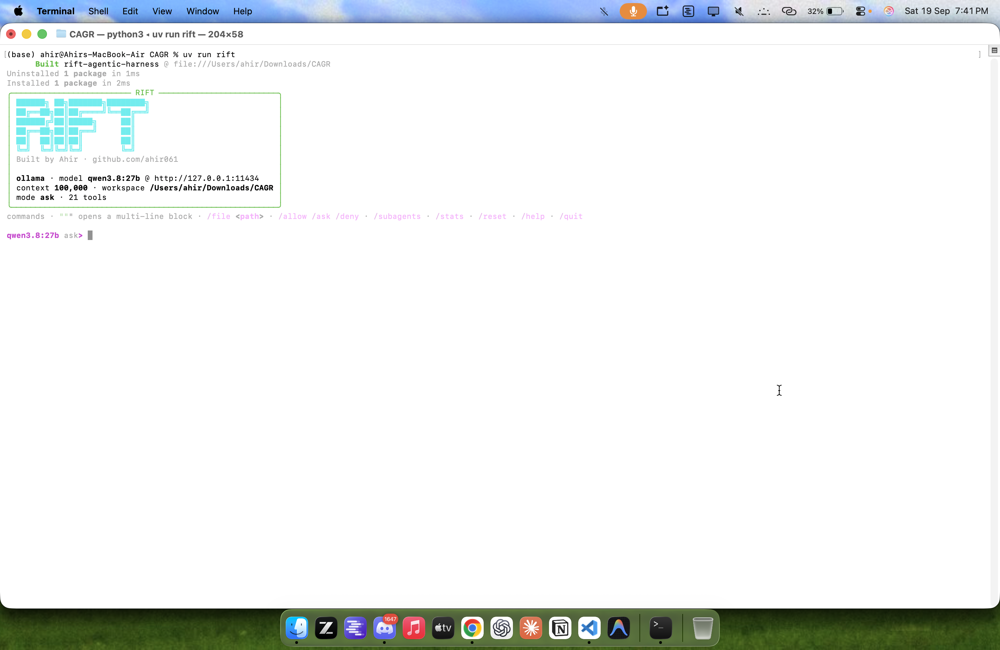

# Rift




**A lightweight Agentic Coding Harness for local & hosted LLMs.**

Built by [Ahir](https://github.com/ahir061).

Rift is a lightweight agentic coding harness that turns supported language models into workspace-aware coding agents. It provides a focused agent loop for exploring code, searching files, applying patches, running commands and tests, inspecting Git history, and streaming progress through the terminal or an OpenAI-compatible API.

The project is local-first, provider-independent, and intentionally compact: one
agent loop powers both the interactive CLI and the HTTP API.

## Highlights

- Works with Ollama, OpenAI, OpenRouter, and OpenAI-compatible endpoints.
- Streams model output, tool activity, token usage, and progress in the terminal.
- Includes workspace-aware file, search, shell, test, Git, snapshot, and debug tools.
- Supports `ask`, `deny`, and `allow` permission modes.
- Limits oversized reads and tool results before they enter the model context.
- Detects repeated tool failures and runaway agent loops.
- Exposes an OpenAI-compatible chat-completions API.
- Offers optional sequential sub-agents with declared file ownership.
- Runs on macOS, Linux, and Windows with environment-aware instructions.

## Quick start

Rift requires Python 3.12 or newer. Install it from this repository with `uv`:

```bash
uv tool install --force .
```

Start Rift inside the project you want it to work on:

```bash
cd /path/to/project
rift
```

By default, Rift connects to Ollama at `http://127.0.0.1:11434` and uses
`qwen3.8:27b`.

Run a single task without opening the interactive session:

```bash
rift "inspect this repository and explain how requests flow through it"
```

Target a different workspace:

```bash
rift --workspace /path/to/project
```

## Terminal experience

On startup, Rift displays its active model, provider endpoint, context window,
workspace, permission mode, and available tool count. During a task it shows
model progress, tool calls, concise tool results, context usage, and session
token totals.

Interactive commands:

| Command | Action |
| --- | --- |
| `/help` | Show available commands |
| `/allow`, `/ask`, `/deny` | Change the permission mode |
| `/models` | List models configured for the active provider |
| `/model <id>` | Switch models without restarting the session |
| `/file <path>` | Run a task stored in a text file |
| `/subagents` | Enable or disable sub-agent delegation |
| `/stats` | Show context, message, token, step, and timing totals |
| `/reset` | Clear conversation history |
| `/quit` | Exit Rift |

Enter `"""` to begin a multiline task and close it with another `"""` on its
own line.

## Model providers

Ollama is the default provider and does not require a configuration file:

```bash
rift --model qwen3.8:27b
```

Use a hosted provider explicitly:

```bash
rift --provider openai --model gpt-6-astra
rift --provider openrouter --model deepseek/deepseek-v4-flash-0731
```

Rift also works with services that implement the OpenAI chat-completions and
tool-calling protocol:

```bash
rift --provider openai \
  --base-url http://localhost:8000/v1 \
  --model llama-3.1-8b
```

Built-in defaults:

| Provider | Model | Endpoint | API key variable |
| --- | --- | --- | --- |
| Ollama | `qwen3.8:27b` | `http://127.0.0.1:11434` | Not required |
| OpenAI | `gpt-6-astra` | `https://api.openai.com/v1` | `OPENAI_API_KEY` |
| OpenRouter | `deepseek/deepseek-v4-flash-0731` | `https://openrouter.ai/api/v1` | `OPENROUTER_API_KEY` |

The selected model must support tool calling. If a provider does not emit tool
calls correctly while streaming, retry with `--no-stream`.

## Configuration

Copy `.env.example` to `.env` for a simple local setup:

```dotenv
RIFT_MODEL=qwen3.8:27b
RIFT_BASE_URL=http://127.0.0.1:11434
# RIFT_API_KEY=...
```

For multiple providers, create `providers.yaml` interactively:

```bash
rift init-provider
```

Or configure one without prompts:

```bash
rift init-provider \
  --name openrouter \
  --base-url https://openrouter.ai/api/v1 \
  --api-key sk-or-v1-example \
  --model deepseek/deepseek-v4-flash-0731
```

The default configuration path is:

- macOS and Linux: `~/.config/rift/providers.yaml`
- Windows: `%APPDATA%\rift\providers.yaml`

Override it with `--config PATH` or `RIFT_CONFIG`.

Example configuration:

```yaml
providers:
  openrouter:
    base_url: https://openrouter.ai/api/v1
    api_key: sk-or-v1-example
    models:
      - deepseek/deepseek-v4-flash-0731
      - openai/gpt-6-astra
    default: deepseek/deepseek-v4-flash-0731

  local-vllm:
    base_url: http://127.0.0.1:8000/v1
    default: Qwen/Qwen3-Coder
```

Custom provider names use the OpenAI-compatible protocol unless `kind: ollama`
is specified. When `models` is present, Rift restricts model selection to that
list. Without an explicit `default`, the first model becomes the default.

Provider configuration precedence is:

```text
command-line flag > providers.yaml > environment variable > built-in default
```

Manage a provider's model list from the CLI:

```bash
rift --provider openrouter --add openai/gpt-6-astra
rift --provider openrouter --set-default deepseek/deepseek-v4-flash-0731
```

## Permissions and safety

Rift separates read-only tools from operations that may alter the workspace or
execute code.

| Mode | Behaviour |
| --- | --- |
| `ask` | Prompt before every mutating or executable tool call; default for the CLI |
| `deny` | Refuse mutating and executable tools; default for the API server |
| `allow` | Execute tools without prompting |

Examples:

```bash
rift --mode deny "review this repository for maintainability issues"
rift --mode ask "fix the failing parser tests"
rift --mode allow "format the project and run its test suite"
```

File tools reject paths outside the selected workspace. Shell commands still run
with the permissions of the Rift process, so `allow` mode should only be used
with trusted models and trusted prompts.

Every task has repeated-failure protection and a 1,000-step emergency ceiling.
Set a smaller explicit limit when desired:

```bash
rift --max-steps 30 --retry-limit 5 "refactor the API layer"
```

## Toolset

Rift supplies the model with tools for:

- bounded file reading and directory listing;
- regular-expression search and glob-based file discovery;
- complete file writes and unified-diff patches;
- shell commands and pytest execution;
- Git status, history, diffs, and file restoration;
- environment and file metadata inspection;
- dependency installation;
- workspace snapshots, diffs, and restoration;
- Python syntax checks, optional Ruff checks, and execution tracing;
- rerunning the previous shell command.

Tool output is truncated before being returned to the model to reduce context
pressure. Large files must be read in explicit line ranges.

## Sub-agents

Sub-agents are disabled by default. Enable them at startup or from the session:

```bash
rift --subagents
```

Each delegated task runs sequentially in a fresh conversation. The parent agent
assigns a set of owned files, integrates the result, and includes the child's
token usage in the session totals. Sub-agents cannot create further sub-agents.

## OpenAI-compatible API

Start the server:

```bash
rift serve --port 8000
```

Available endpoints:

```text
GET  /health
GET  /api/v1/health
GET  /v1/models
POST /v1/chat/completions
```

Submit a task:

```bash
curl http://127.0.0.1:8000/v1/chat/completions \
  -H 'Content-Type: application/json' \
  -d '{
    "model": "qwen3.8:27b",
    "messages": [
      {"role": "user", "content": "summarize this workspace"}
    ]
  }'
```

Set `"stream": true` to receive server-sent events. Intermediate model output
and tool activity are emitted as `reasoning_content`; the completed response is
emitted as `content`.

Protect the API with a bearer key:

```bash
rift serve --api-key your-secret-key
```

The server binds to `127.0.0.1` and starts in `deny` mode by default. Exposing an
`allow`-mode server grants clients the ability to execute commands in its
workspace and should be treated as remote code execution.

## Python interface

Rift can also be embedded directly:

```python
from pathlib import Path

from rift import Rift

agent = Rift(
    model="qwen3.8:27b",
    provider="ollama",
    base_url="http://127.0.0.1:11434",
    workspace=Path.cwd(),
    mode="ask",
)

agent.run("explain the architecture of this project")
```

Use `run_events()` instead of `run()` when integrating with another interface.
It yields step, token, usage, message, tool, result, completion, and error events.

## Architecture

Rift keeps model orchestration, tools, provider resolution, and transports
separate:

```text
CLI ─────────────┐
                 ├── Rift agent loop ── provider ── LLM
HTTP API ────────┘          │
                            └── workspace tools
```

The terminal and API consume the same event stream, so tool behaviour and loop
semantics remain consistent across both interfaces.

## Development

Install the project in editable mode:

```bash
uv tool install --force --editable .
```

Run the test suite and static checks from a development environment:

```bash
python -m pytest -q
ruff check .
mypy .
```

The package is named `rift-agentic-harness`, and its primary executable is
`rift`.

## Compatibility

The previous `harness` executable, `Harness` Python class, `HARNESS_*`
environment variables, and legacy configuration directory remain available for
existing installations. New integrations should use the Rift names.
